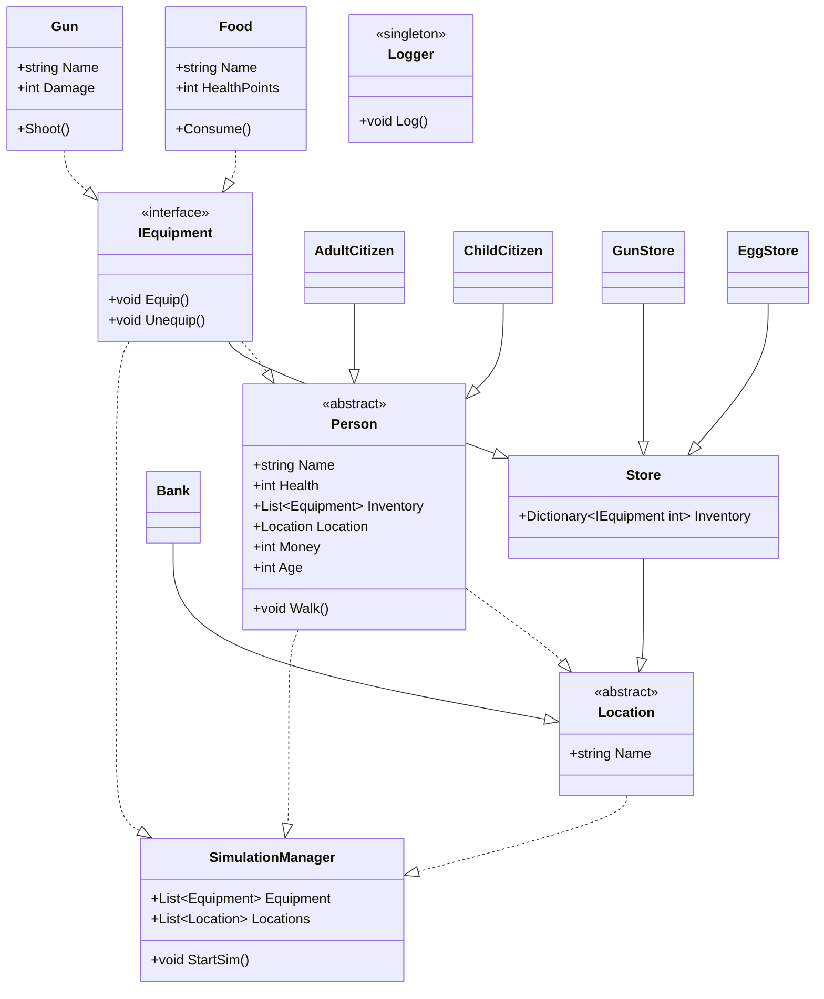

```mermaid
classDiagram
    class IEquipment{
        <<interface>>
        +void Equip()
        +void Unequip()
    }
    Food ..|> IEquipment
    Gun ..|> IEquipment

    class Person{
        <<abstract>>
        +string Name
        +int Health
        +List~Equipment~ Inventory
        +Location Location
        +int Money
        +int Age
        +void Walk()
    }
    AdultCitizen --|> Person
    ChildCitizen --|> Person
    IEquipment ..|> Person

    class AdultCitizen{
    }
    class ChildCitizen{
    }

    class Location{
        <<abstract>>
        +string Name
    }
    Bank --|> Location
    Store --|> Location
    Person ..|> Location

    class Logger{
        <<singleton>>
        +void Log()
    }

    class Food{
        +string Name
        +int HealthPoints
        +Consume()
    }

    class Gun{
        +string Name
        +int Damage
        +Shoot()
    }

    class Store{
        +Dictionary~IEquipment int~ Inventory
    }
    GunStore --|> Store
    EggStore --|> Store
    IEquipment --|> Store

    class SimulationManager{
        +void StartSim()
        +List~Equipment~ Equipment
        +List~Location~ Locations
    }
    IEquipment ..|> SimulationManager
    Person ..|> SimulationManager
    Location ..|> SimulationManager

```