# PeopleVille projekt

## TODO
### Benjamin
- [ ] Exceptions, and lots of them?!
### Mikkel
- [x] Rework Inventory
- [ ] Threading
- [ ] Begynd på relationer mellem citizens (hvis muligt)

**Husk at opdatere mermaid løbende**

```mermaid
classDiagram
    class IWorldBuilder {
        <<interface>>
        +IGameManagerBuilder AddGameManager()
        +World Build()
    }
    class IGameManagerBuilder {
        <<interface>>
        +IEquipmentBuilder AddEquipment()
    }
    class IEquipmentBuilder {
        <<interface>>
        +IEquipmentBuilder FromFolder(string)
        +IEquipmentBuilder FromFile(string)
        +IEquipmentBuilder FromRange(IEnumerable~IEquipment~)
        +ILocationBuilder AddLocations()
    }
    class ILocationBuilder {
        <<interface>>
        +ILocationBuilder FromFolder(string)
        +ILocationBuilder FromFile(string)
        +ILocationBuilder FromRange(IEnumerable~Location~)
        +IPersonBuilder AddPersons()
    }
    class IPersonBuilder {
        <<interface>>
        +IPersonBuilder FromFolder(string)
        +IPersonBuilder FromFile(string)
        +IPersonBuilder FromRange(IEnumerable~Person~)
        +IPersonBuilder WithRandomItems(int)
        +IWorldBuilder EndWorldBuilding()
    }

    class WorldBuilder {
        +IGameManagerBuilder AddGameManager()
        +World Build()
    }
    class World {
        +GameManager manager
        +List~IEquipment~ Equipment
        +List~Person~ People
        +List~Location~ Locations
    }

    class GameManager {
        +event TickDone
        +Task StartClock()
    }

    class Person {
        <<abstract>>
        +string Name
        +int Health
        +int Age
        +int Money
        +List~IEquipment~ Inventory
        +Location CurrentLocation
        +GameManager Manager
        +World World
        +bool Dead
        +void Initialize()
        +void Walk(Location)
    }
    class AdultCitizen {
        +void Initialize()
        +void DoSomething()
    }
    class ChildCitizen
    class PeopleBuilder {
        +List~Person~ CreatePeople(int)
    }

    class IEquipment {
        <<interface>>
        +void Equip()
        +void Unequip()
        +void Use(Person)
    }
    class Gun {
        +string Name
        +int Damage
        +void Use(Person)
    }
    class Food {
        +string Name
        +int HealthPoints
        +void Use(Person)
    }

    class Location {
        <<abstract>>
        +string Name
        +void UseLocation(Person)
    }
    class Store {
        +Dictionary~object,int~ Inventory
    }
    class Bank {
        +void UseLocation(Person)
    }
    class GunStore {
        +void UseLocation(Person)
    }
    class EggStore {
        +void UseLocation(Person)
    }
    class LocationBuilder {
        +List~Location~ CreateLocations(int)
    }

    class RNG {
        +int Range(int,int)
        +int ThrowDice(Die,int)
    }
    class Dices {
        +Die D2
        +Die D3
        +Die D4
        +Die D6
    }
    class Die {
        +int Sides
    }

    WorldBuilder ..|> IWorldBuilder
    WorldBuilder ..|> IGameManagerBuilder
    WorldBuilder ..|> IEquipmentBuilder
    WorldBuilder ..|> ILocationBuilder
    WorldBuilder ..|> IPersonBuilder

    WorldBuilder --> World
    World --> GameManager
    World --> Person
    World --> Location
    World --> IEquipment

    Person --> GameManager
    Person --> World
    Person --> Location
    Person o-- IEquipment
    AdultCitizen --|> Person
    ChildCitizen --|> Person
    PeopleBuilder --> Person

    Gun ..|> IEquipment
    Food ..|> IEquipment

    Store --|> Location
    Bank --|> Location
    GunStore --|> Store
    EggStore --|> Store
    LocationBuilder --> Location

    RNG --> Die
    Dices --> Die
```

