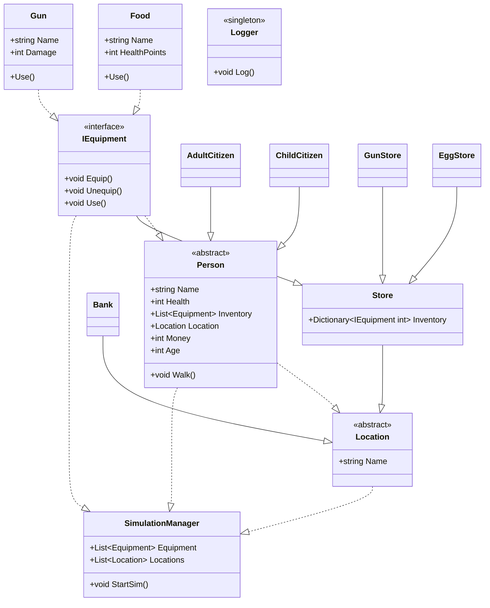

# PeopleVille projekt

## TODO
### Benjamin
- [ ] Implementer dynamisk import af "eksterne" dll'er
- [ ] Find ud af hvordan tid skal fungere
### Mikkel
- [ ] En person skal kunne have en gun og food
- [ ] Lav worldbuilder

**Huskt at opdatere mermaid løbende**

